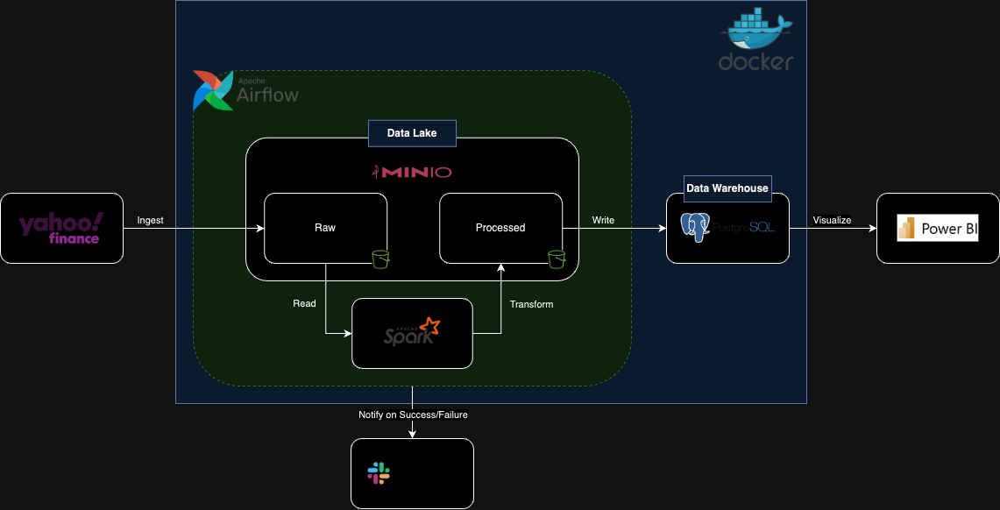
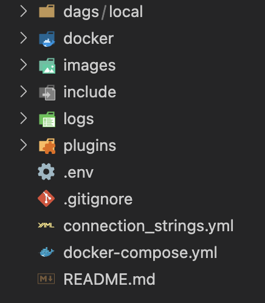
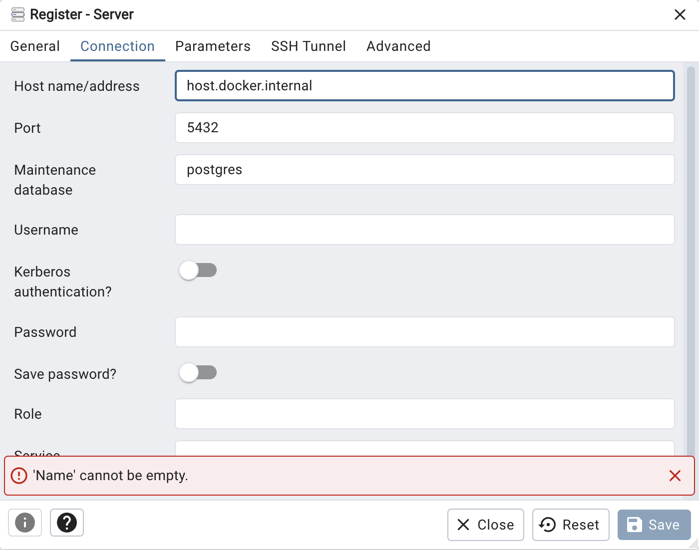
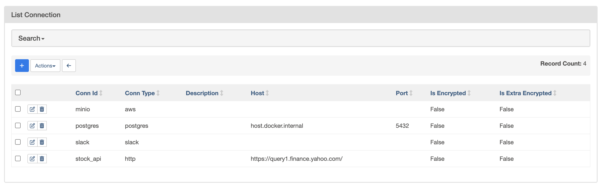
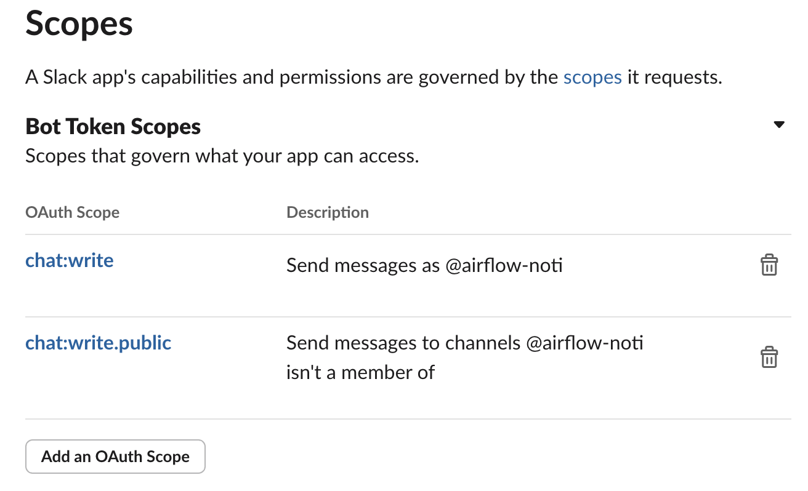

# Stock Market Data Pipeline

This Airflow project automates the process of fetching, transforming, and loading stock market data into a data warehouse (DW). It includes tasks such as checking API availability, fetching stock prices, storing and formatting the data, and loading the processed data into a data warehouse.

## Features
- **Daily Data Fetching**: Automatically pulls stock prices for a specified symbol (`AAPL`) every day.
- **API Availability Check**: Uses a sensor to ensure the stock API is accessible before fetching data.
- **Data Transformation**: Formats the stock data using a Dockerized Spark application.
- **Slack Notifications**: Sends success or failure notifications to a specified Slack channel.
- **Customizable**: Can be extended to include additional symbols or endpoints.


## Pipeline

Please refer to the image below for the pipeline of this project.



## Prerequisites
1. **Python**: preferably Python 3.8.
2. **Docker**
3. **Slack Connection**: An Airflow Slack connection (`slack`) with access to the desired Slack channel.
4. **Stock API Connection**: An Airflow connection (`stock_api`) with the following configuration:
   - `host`: Base URL of the stock API.
   - `extra`: JSON containing `endpoint` and `headers`.

## Steps to Clone and Run the Project

### 1. Clone the Repository
Use the following commands to clone the repository and navigate to the project directory:
```bash
git clone <repository-url>
cd <repository-name>
```

### 2. Setting Up the `.env` File for Airflow and Related Services
Please create `.env` file in the location below 



```bash
# PostgreSQL Configuration
POSTGRES_USER=<your_postgres_username>
POSTGRES_PASSWORD=<your_postgres_password>
POSTGRES_DB=<your_postgres_database> # the database here is used for Airflow's metadata

# PgAdmin Configuration
PGADMIN_DEFAULT_EMAIL=<your_pgadmin_email>
PGADMIN_DEFAULT_PASSWORD=<your_pgadmin_password>

# MinIO Configuration
MINIO_ROOT_USER=<your_minio_user>
MINIO_ROOT_PASSWORD=<your_minio_password>

# Airflow Configuration
AIRFLOW__CORE__SQL_ALCHEMY_CONN=postgresql+psycopg2://<username>:<password>@<hostname>/<database_name>

AIRFLOW__CELERY__RESULT_BACKEND=db+postgresql://<username>:<password>@<hostname>/<database_name>

AIRFLOW__CORE__FERNET_KEY=''

_AIRFLOW_WWW_USER_USERNAME=<your_airflow_ui_username>
_AIRFLOW_WWW_USER_PASSWORD=<your_airflow_ui_password>
```

### 2. Start the Dockerized Applications
To build and start all services defined in the `docker-compose.yml` file, run the following command:

```bash
docker-compose up --build -d
```

### 3. Register the PostgreSQL Server in PGAdmin
After the containers are up and running, you can access PGAdmin at http://localhost:5050.

1. Open PGAdmin in your browser.

2. Register a new server:
    - Right-click on Servers in the left panel and select Register -> Server.
    - In the General tab:
        - You can enter any name in the Name field for your reference.


    - In the Connection tab:
     
        - Host name/address: `host.internal.docker`.
        
        - Port: 5432 (default PostgreSQL port).
        
        - Maintenance database: postgres.
        
        - Username: Your PostgreSQL username.
        
        - Password: Your PostgreSQL password.


After entering the necessary information, click Save to establish the connection.

You have now set up the server and database for your stock data.

### 4. Set up Connections in Airflow
Please follow the connection_string.yml to set up the connections in Airflow.


### 5. Run Dags
You can access to Airflow UI and trigger the DAG at this stage.

### Slack Set up
This is an optional part, if you have already known how to set up Slack for sending DAG run status, please skip this part.

1. Create New Slack App: Go to https://api.slack.com/apps and click on the Create New App button, then choose `From scratch` option to create a new slack application.
2. In the next popup add a new `App Name` and select the `Slack Workspace` (created beforehand) and click on the `Create App` button
3. Navigate to `OAuth & Permissions`, then add permission as below, then go to OAuth Tokens and create you token (this is the token for setting connection in Airflow)

4. Navigate to the DAG file and change the `channel="<your channel name>` in SlackNotifier.
5. Run DAG and receive status email in your channel!


